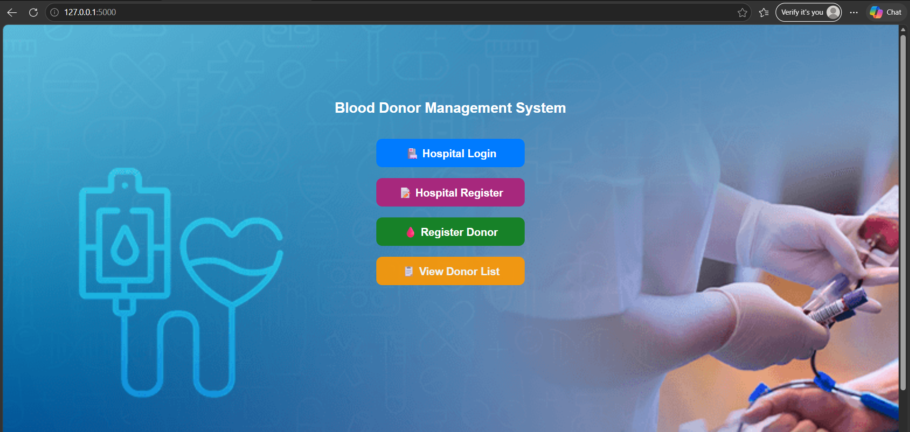
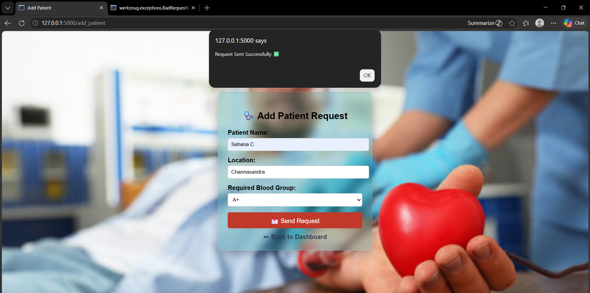

# 🩸 Emergency Blood Request and Donor Management System

## 📌 Project Overview

The Emergency Blood Request and Donor Management System is a Flask-based web application that connects hospitals with blood donors. It simplifies blood donor registration, patient requests, hospital management, and email notifications.

## ✨ Features

- 👤 Donor Registration and Login
- 🏥 Hospital Registration and Login
- 🩸 Add Blood Donor
- ❤️ Add Patient Blood Request
- 📋 View Donor List
- 📧 Email Notification to Eligible Donors
- 🔒 Secure Login System

## 🛠 Technologies Used

- Python
- Flask
- HTML
- CSS
- SQLite
- SMTP (Email)

## 📂 Project Structure

```
blood_donor_project/
│
├── app.py
├── requirements.txt
├── templates/
├── database.db
└── blood.db
```

## 🚀 How to Run

```bash
pip install -r requirements.txt
python app.py
```

## 📌 Future Enhancements

- OTP Verification
- SMS Notification
- Blood Inventory Management
- Admin Dashboard

## 👩‍💻 Author

Harshitha C

## 📸 Project Screenshots

### 🏠 Home Page


### 🏥 Hospital Login


### ➕ Add Patient


### 🩸 Blood Request


### 📧 Email Alert


### ✅ Confirmation Message


### 👥 Donor List


